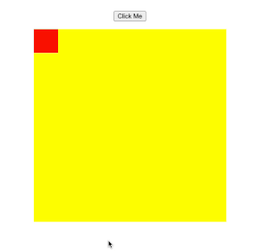
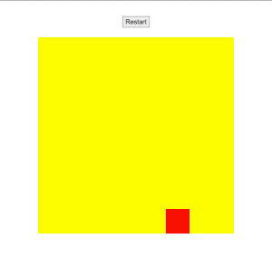

<h1 align="center">A simple JS animation example</h1>
  

An <a href="https://www.w3schools.com/howto/howto_js_animate.asp">example</a> of a square that, on button click, goes from one corner to another and stops:

 
  

Redone to loop back and forth in different directions: 

 
